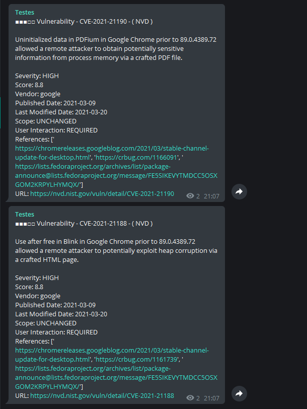

# Alert for new vulnerabilities

This script searches NVD's website for new CVES, alerting you by email or telegram. You can configure a list of products that interest you or receive from all vulnerabilities.

## Info

In the settings file, you need to provide valuable information for the alert to work correctly, such as the score or product list that interests you.

For telegram alerting to work, you need a toke and chat id. Shipping is done via requests.

## Settings

Make adjustments to settings according to your preferences.

Only send CVE from desired manufacturers:

```
products:
  - "windows"
  - "microsoft"
  - "oracle"
  - "mcafee"
  - "sap"
```

Tell us how you want to receive your alerts:

Email

```
email:
    active: True
    to:
      - "to@to.com"
    template: "config/template.html"
```

Telegram

```
telegram:
  active: True
  token: "TOKEN"
  chat: "CHAT"
  template: "config/telegram.md"
```

## Install

```
git clone https://github.com/andreyglauzer/VulnAlert.git
cd VulnAlert
pip install -r requirements.txt
```

## Use

```
usage: VulnAlert [-h] --config CONFIGFILE [--service]
                 [--timesleep ARGTIMESLEEP]
                 [--log {DEBUG,INFO,WARNING,ERROR,CRITICAL}] [--engine {cve}]

```

## Command

```
python3 VulnAlert.py --config config/config.yml --engine cve

``` 

## Examples Email/Telegram

<p align="center">
  
</p>
