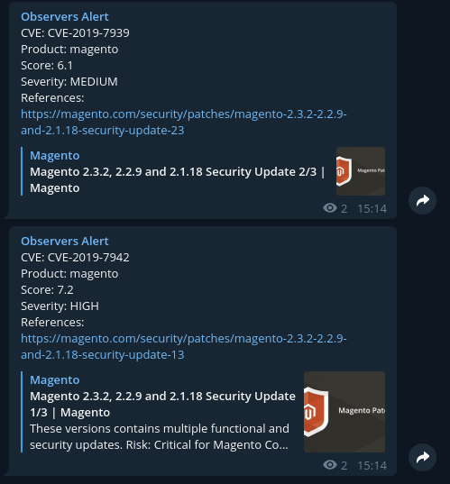

# Alert for new vulnerabilities

This script searches NVD's website for new CVES, alerting you by email or telegram. You can configure a list of products that interest you or receive from all vulnerabilities.

## Info

In the settings file, you need to provide valuable information for the alert to work correctly, such as the score or product list that interests you.

For telegram alerting to work, you need a toke and chat id. Shipping is done via requests.

## Install

```
git clone https://github.com/andreyglauzer/VulnAlert.git
cd VulnAlert
pip install -r requirements.txt
```

## Use

```
usage: cve-alert.py [-h] [-c CONFIG] [-i] [-p] [-t TYPE]

optional arguments:
  -h, --help            show this help message and exit
  -c CONFIG, --config CONFIG
                        The directory of the settings file, in Yaml format.
  -i, --initial         Use this command before --config, if it is the first
                        time you are running the script, so that it can write
                        to the database all CVES already reported to date,
                        without the alert being sent.
  -p, --products        Use this command before --config if you would like to
                        receive only CVES alerts whose product is from the
                        list in the configuration files.
  -t TYPE, --type TYPE  Enter the type of alert you want to send. Email or
                        Telegram, if you want to use both use: all

```

## Examples Email/Telegram

<p align="center">
  
</p>
<p align="center">
  
</p>
